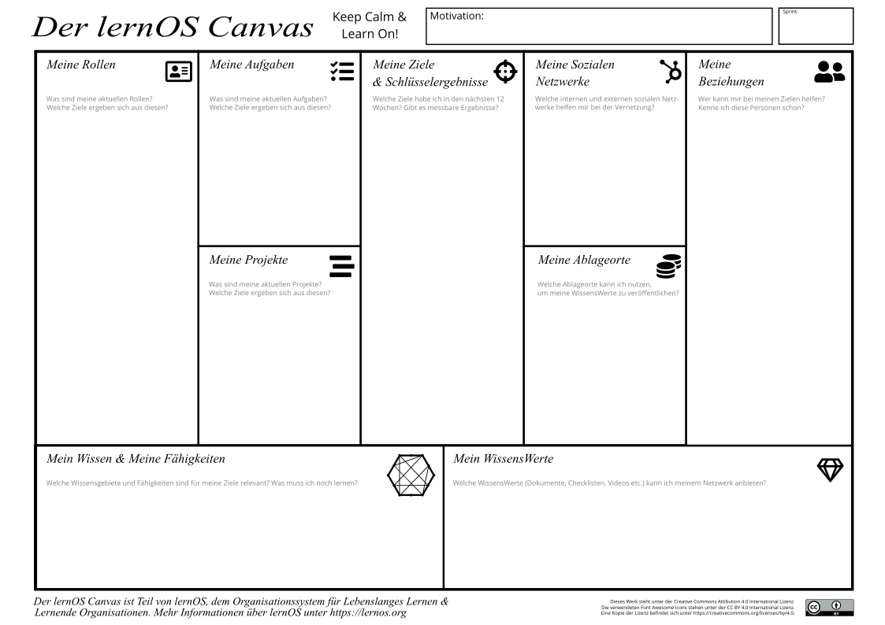

### Lege dein Ziel für die nächsten 12 Wochen fest (Kata 1)

In dieser Kata wählst Du Dein Ziel für den Sprint. Das Ziel kann bis zur 4. Woche verfeinert werden, aber nicht danach.

Ein Canvas ist eine visuelle Struktur, die für die strukturierte Bearbeitung
mehrere Bereiche parallel verwendet werden kann. Auf diese Weise verwendet
man einen Canvas als visuelle Checkliste. Er kann aber auch für das Erzählen komplexer Geschichten verwendet werden. Die Idee kam ursprünglich von Alex
Osterwalder, der den [Business Model
Canvas](https://en.wikipedia.org/wiki/Business_Model_Canvas) entwickelt hat. Der
lernOS Canvas verwendet die gleiche Grundstruktur wie der
Business Model Canvas. Doch die Benennungen der Bereiche wurden geändert, um
die Arbeitsthemen von lernOS abzudecken.

Der lernOS Canvas kann von der [lernOS
Webseite](https://lernOS.org) in verschiedenen Formaten heruntergeladen
(z.B. PowerPoint, PDF, PNG) werden. Um mit dem Canvas flexibel arbeiten zu können,
solltest du nie darauf schreiben. Aus diesem Grund wurden
Haftnotizen erfunden!

Der obere Teil des Canvas enthält
Motivations- oder Mission Statement (wenn du eines hast) und Nummer oder Datum des Sprints. Im
Bereich "Meine Ziele & Schlüsselergebnisse" werden die Ziele für den
aktuellen Sprint dokumentiert. Die Bereiche "Meine Rollen", "Meine
Aktivitäten", "Meine Projekte" und "Mein Wissen & Meine Fähigkeiten" können
genutzt werden, um mögliche Ziele zu identifizieren. Die Bereiche "Meine
Beziehungen" und "Meine Sozialen Netzwerke" werden zur Identifikation von Personen verwendet,
die bei der Zielerreichung
unterstützen können. Vorhandene Ressourcen (z.B. Dokumente, Checklisten, Videos
etc.) werden in "Meine WissensWerte" aufgeführt. Die bei "Meine
Ablageorte" aufgeführten Ablagen werden genutzt, um wertvolle Ressourcen
großzügig mit dem Netzwerk zu teilen.

_**Dauer:** 25 Minuten_

Was willst du in den nächsten zwölf Wochen erreichen? Wähle ein Ziel, das Dich wirklich, wirklich wichtig ist und bei dem du im Sprint Fortschritte machen kannst. du wirst die die OKR-Methode von Google verwenden, um dieses Ziel zu definieren. Für den NOOB Pfad ist es nicht erste Priorität, das Ziel zu erreichen. Im Fokus steht zu lernen, wie du mit Hilfe eines offenen Arbeitsstils und der Entwicklung eines Netzwerks Ziele einfacher erreichst.

Wähle ein Ziel für die nächsten 12 Wochen. Verwende die Fragen
"Ist es mir wirklich, wirklich wichtig?", "Kann ich es in 12 Wochen
erreichen?", und "Kann mein Netzwerk helfen?", um zu testen, ob
das Ziel für den Sprint geeignet ist. Wenn du Probleme hast, ein gutes
Ziel zu finden, denke an Ziele zu deine Rollen, Aktivitäten oder
Projekten. Wenn du dazu beitragen möchtes, die Welt zu einem
besseren Ort zu machen, kannst du dir auch ein Ziel aus dem Bereich der [17
Ziele für nachhaltige Entwicklung der Vereinten
Nationen](https://www.un.org/sustainabledevelopment/sustainable-development-goals) wählen.

Verwende die Methode Objective & Key Results
(OKR), um dein Ziel genauer zu beschreiben. Schreibe unten dein Ziel auf.
Definiere 2-4 Schlüsselergebnisse pro Ziel, um dir bei der Fortschrittkontrolle zu helfen.
Du solltest die Schlüsselergebnisse auf einer Skala von 0,0-1,0
messen können. Um sich ehrgeizige Ziele zu setzen, gilt eine Fertigstellungsrate
von 0,7 als Erfolg.

*Ich will (Ziel):* \...

*gemessen an (Schlüsselergebnisse):*

1. ...
2. ...
3. ...
4. ...

**Weitere Informationen:**

- Wikipedia Artikel [SMART Criteria](https://en.wikipedia.org/wiki/SMART_criteria)
- MIT Sloan Artikel [With Goals, FAST Beats SMART](https://sloanreview.mit.edu/article/with-goals-fast-beats-smart)
- Ted Talk [How We Can Make the World a Better Place by 2030](https://www.youtube.com/watch?v=o08ykAqLOxk)
- Video [How Google Sets Goals: OKRs](https://www.youtube.com/watch?v=mJB83EZtAjc) mit Google
  Ventures Partner Rick Klau
- Buch [ Introduction To OKRs](https://www.oreilly.com/business/free/files/introduction-to-okrs.pdf) von Christina Wodtke
- Buch [The Beginner’s Guide To OKR](https://felipecastro.com/resource/The-Beginners-Guide-to-OKR.pdf)
  von Felipe Castro
