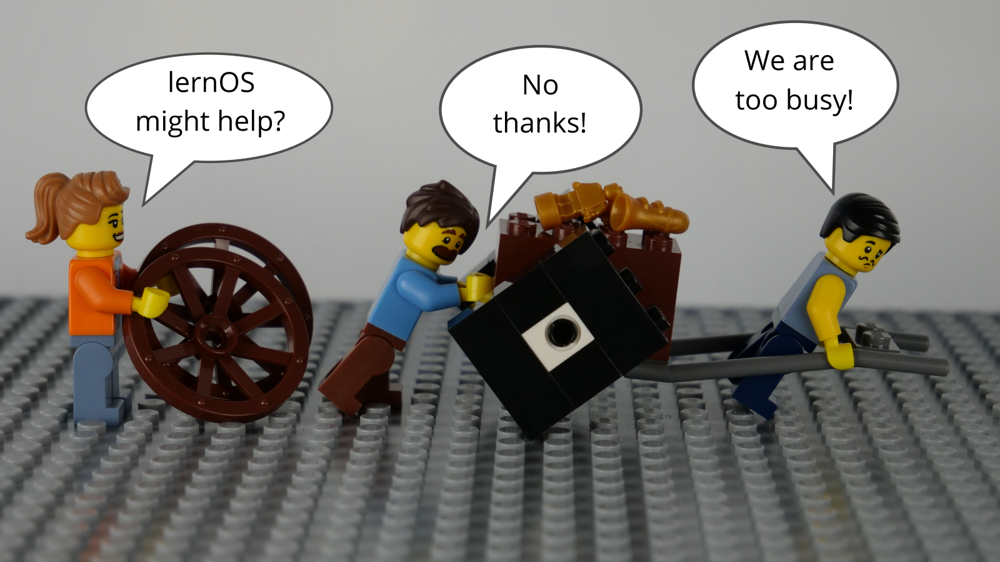
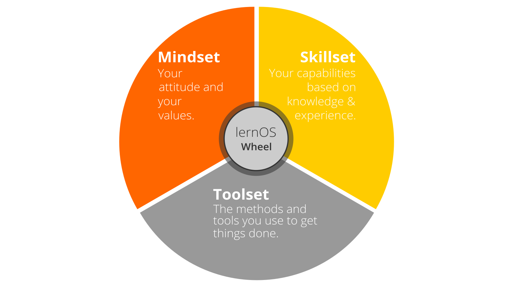
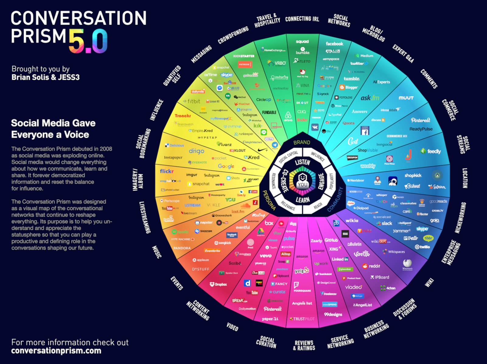

## lernOS Wheel: Mindset, Skillset, and Toolset

Mastering the VUCA world of the 21st century requires to be open for change and new approaches. There are a lot of tools and methods out there. But when one is not open to give it a try, experiment, and fail there will be no success. Like the people with the "square wheels" in the image below we are often too busy to see new opportunities.

Adopting new practices in life, school, or work is not only about using digital tools. To switch from "square wheels" to "round wheels" the personal attitude, values, and skills have also to be taken into account. lernOS calls these three dimensions mindset, skillset, and toolset. To focus only on some dimensions might help. But for the best results all three should be considered in the personal development process.

### Mindset: Your Attitude and Values

The mindset can be described as the attitudes and values that lead to actions and visible results. These develop over time and form the culture of organizations and society. When we act in the world we get feedback and learn from it. Over time our mind creates mental models of the world and values that guide our future actions ([Boisot, 2004](http://www.rrojasdatabank.info/thermo/20388.pdf)). To successfully navigate the VUCA world these five values are important to be successful (Buhse 2014 & Petry, 2014):

1. **NETWORKING** over isolation
1. **TRUST** over suspiciousness
1. **OPENNESS** over silos
1. **PARTICIPATION** over exclusion
1. **AGILITY** over stability

There is no ranking in the values above but for some people [openness](https://en.wikipedia.org/wiki/Openness) seems to be the core value for a 21st century mindset. It means being open to new experiences, knowledge, and ideas as well as sharing knowledge, ideas, and content openly (see also the [Open Definition](https://opendefinition.org)). You should develop an "open first mindset" over time as described in the [Open First Manifesto](http://innovationsbeirat.de/open-first):

**ProTip:** your mindset is not fixed it can grow over time. Watch Carol Dweck's video on [Developing a Growth Mindset](https://www.youtube.com/watch?v=hiiEeMN7vbQ) to learn more about it.

### Skillset: Your Capabilities

Since the 1980s skills like solving problems and interacting with others in creative ways became most important to be successful. These are also skills that can't be easily replaced by automation and artificial intelligence in the future. To get fit for the 21st century you have to train the following skills ([Framework for 21st Century Learning](http://www.p21.org/our-work/p21-framework), [DigiComp 2.1 Framework](https://ec.europa.eu/jrc/en/publication/eur-scientific-and-technical-research-reports/digcomp-21-digital-competence-framework-citizens-eight-proficiency-levels-and-examples-use)):

You can use this table to do a self assessment at the beginning of a lernOS Sprint. The levels 1-5 are according to the [Dreyfus model of skill acquisition](https://en.wikipedia.org/wiki/Dreyfus_model_of_skill_acquisition) (1 = Novice, 2 = Advanced Beginner, 3 = Competence, 4 = Proficient, 5 = Expert). Just put your current skill level in the "As-Is" column and your desired skill level in the "To-Be" column. You can then set a focus for your learning activities.

| Skill | As-Is | To-Be |
|------------------------------|----|----|
| **Creativity and Innovation** |  |  |
| Think creatively |  |  |
| Work creatively with others |  |  |
| Implement innovations |  |  |
| **Critical Thinking And Problem Solving** |  |  |
| Identifying needs and technological responses |  |  |
| Reason effectively |  |  |
| Make judgments and decisions |  |  |
| Solve technical and non-technical problems |  |  |
| Creatively using technologies to solve problems |  |  |
| **Communication** |  |  |
| Articulate thoughts and ideas clearly and effectively |  |  |
| Listen effectively to decipher meaning |  |  |
| Use communication to inform, instruct, motivate and persuade |  |  |
| Utilize multiple media and technologies |  |  |
| Communicate effectively in diverse environments |  |  |
| **Collaboration** |  |  |
| Work effectively and respectfully with diverse teams |  |  |
| Exercise flexibility and willingness to be helpful in making necessary compromises to accomplish a common goal |  |  |
| Assume shared responsibility for collaborative work, and value the individual contributions |  |  |
| Interacting, engaging, sharing, and collaborating through digital technologies |  |  |
| Managing digital identity |  |  |
| **Digital Literacy** |  |  |
| Browsing, searching, filtering data, information and digital content |  |  |
| Evaluating and managing data, information and digital content |  |  |
| Protecting digital devices, personal data and privacy |  |  |
| Developing, integrating, and re-elaborating digital content |  |  |
| Handling Copyright and licences |  |  |
| Programming, Scripting, and Coding |  |  |

**ProTip:** the Mozilla Foundation has developed the [Web Literacy Framework](https://learning.mozilla.org/en-US/web-literacy) with a lot of exercises for developing digital literacy and 21st century skills.

### Toolset: Digital Tools You Use
With the emergence of [Web 2.0](https://www.oreilly.com/pub/a/web2/archive/what-is-web-20.html) in 2005 social media entered the stage. Not everybody needs to know all the tools but you should have an overview, know the principles, and choose the right tools for yourself. The [conversation prism](https://conversationprism.com) gives a nice overview of web 2.0 platforms available today:

For a beginner 28 categories and dozens of tools might be overwhelming. Therefore the following list provides an overview of the most relevant tools for learnOS:

1. **Office & Productivity**, e.g. Dropbox, Evernote, Freemind, G Suite, MindManager, Office 365, OneNote, SharePoint, Trello, XMind
1. **Chat & Messenger**, e.g. Google Hangouts Chat, Mattermost, Microsoft Teams, RocketChat, Slack, Telegram, Threema, WeChat, WhatsApp
1. **Social Networks**, e.g. IBM Connections, Jive, LinkedIn, Mastodon, Twitter, Workplace by Facebook, Xing, Yammer
1. **Videoconference**, e.g. Google Hangouts Meet, GoToMeeting, Microsoft Teams, Skype, Skype for Business, WebEx, Zoom
1. **Weblogs & Wikis**, e.g. Confluence, DokuWiki, LinkedIn (Article), MediaWiki, Medium, tumblr, Wikipedia, Wordpress

**ProTip:** the [lernOS Wiki](https://github.com/cogneon/lernos-core/wiki) contains a list with links to all the mentioned tools. There will be tutorials on how to use them in the future.
