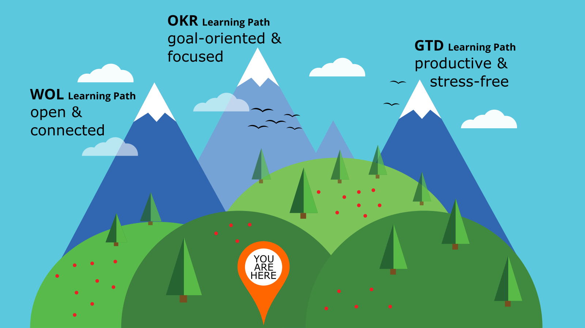

# Learning Paths for Newbies (NOOBs)

A lernOS learning path is a collection of exercises (Katas) with which you learn new skills and develop a new attitude over time. A learning path can be followed within a lernOS sprint. lernOS beginners* (NOOBs) can choose from one of three learning paths:

1. **WOL Learning Path:** in this learning path you'll learn to work **open** and **connected**, as well as how to make your results visible and to narrate about it. The learning path is based on the [Working Out Loud Circle Guides](https://workingoutloud.com/de/circle-guides) by John Stepper.
2. **OKR Learning Path:** this learning path helps you to work and learn **goal-oriented** and **focused**. It is not only about everyday goals, but also about the big goals in work and life (Moonshots). The learning path is based on the method [Objectives & Key Results](https://rework.withgoogle.com/guides/set-goals-with-okrs/steps/introduction/). (OKR) from Google.
3. **GTD Learning Path:** In this learning path you learn to be **productive** in the multitude of tasks and to keep track of every situation in a **stress-less** way. The learning path is based on the method [Getting Things Done](https://gettingthingsdone.com/what-is-gtd/) (GTD) by David Allen.

**ProTip:** Only one of the three learning paths should be chosen for a sprint. All three learning paths can be completed in follow-up sprints. Tandems and circles should not mix learning paths, otherwise you won't be able to benefit from each other's experiences in the weekly.
